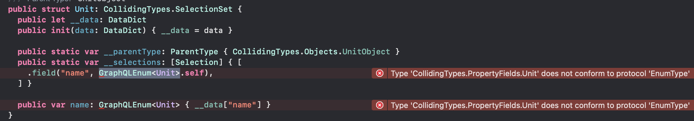
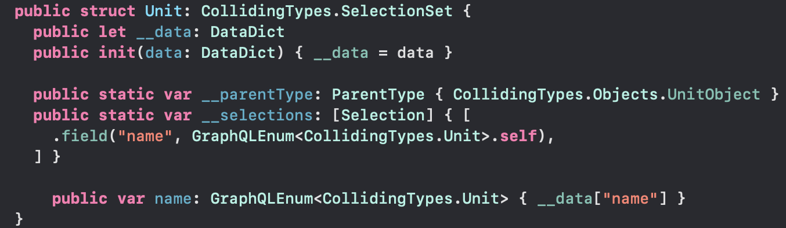

# Collliding Types

The GraphQL schema in `Schema/schema.graphqls` demonstrates a namespace
collision. The issue is that the fragment in `Schema/fragment.graphqls`
selects a `unit` which, when run through `./apollo-ios-cli generate`,
produces a nested `Unit` struct in `Sources/CollidingTypes/Fragments/PropertyFields.graphql`
which when referenced in `GraphQLEnum<Unit>` incorrectly references the nested
`Unit` and not the enum `Unit` from `Sources/CollidingTypes/Schema/Enums/Unit.graphql`.



The solution is to fully qualify the enum:



The code in this repo reproduces the above issue. But the following was
used to generate the code in the `Sources/CollidingTypes`, per the
[Apollo iOS codegen docs](https://www.apollographql.com/docs/ios/code-generation/codegen-cli):

```bash
$ swift package --allow-writing-to-package-directory apollo-cli-install
$ ./apollo-ios-cli generate
# swift build
```

The equivalent set of operations in Xcode also produces the error. Tested with
Xcode 14.1 using apollo-ios v1.0.5.
